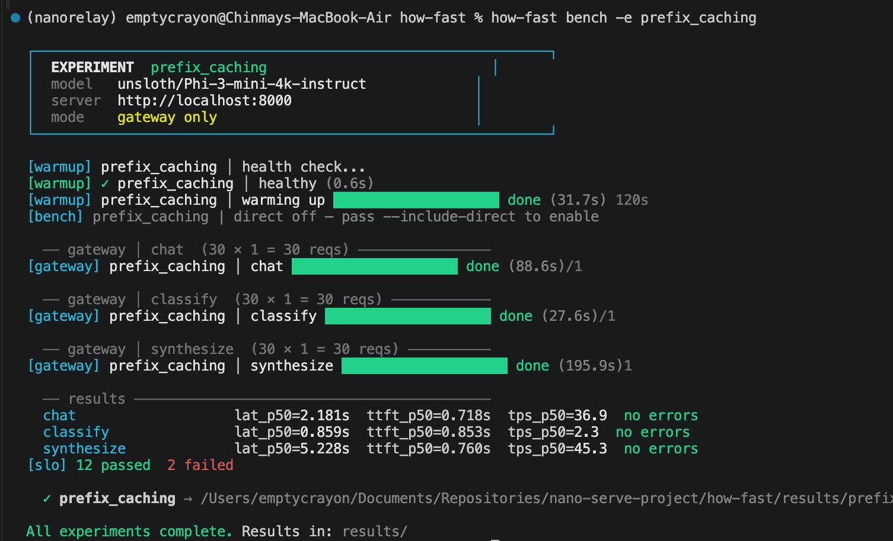
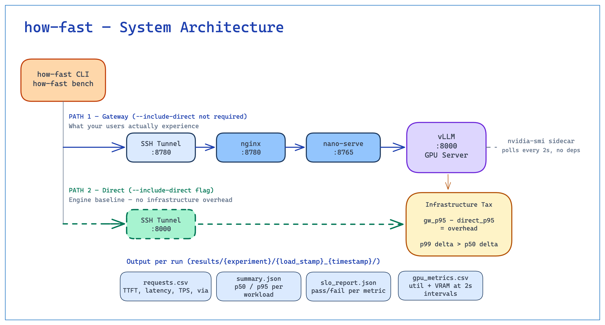
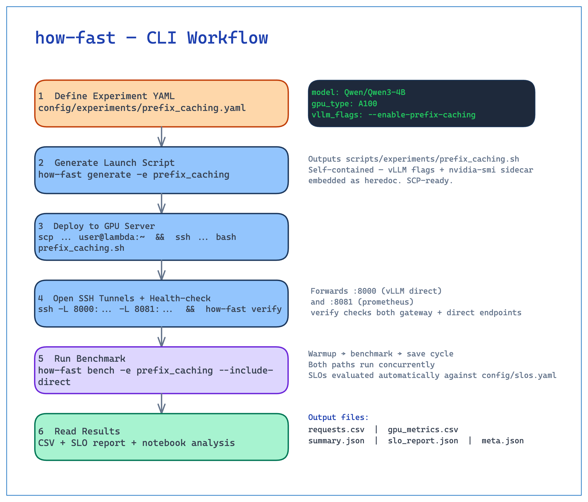
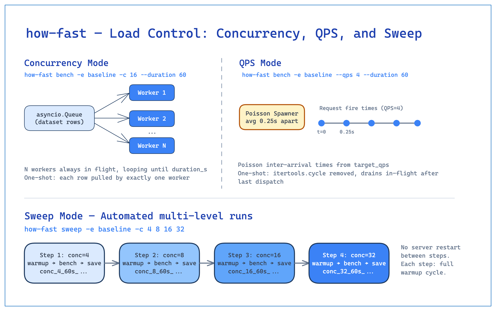

# how-fast

**LLM inference benchmarking tool.** Measures latency, throughput, and GPU utilization across vLLM configurations, with gateway overhead isolation and SLO pass/fail reporting.

---

## Demo

Running a `prefix_caching` experiment against `unsloth/Phi-3-mini-4k-instruct` on a Lambda A10G.



---

## Architecture



Two request paths run concurrently during a benchmark:

**Gateway path** (always on): `how-fast CLI → SSH tunnel → nginx LB → NanoServe gateway → vLLM :8000`

**Direct path** (`--include-direct`): `how-fast CLI → SSH tunnel → vLLM :8000` — bypasses the entire gateway stack and tags results as `<experiment>_direct`

Diffing the two paths gives you a concrete number: how much latency your observability stack, load balancer, and middleware are consuming at p50 and p99. The p99 delta is usually more interesting than the p50 — gateways that look cheap at median tend to have heavy tails.

GPU metrics come from `gpu_monitor.py`, a stdlib-only HTTP server that shells out to `nvidia-smi`. It's embedded as a string in the package so nothing extra needs copying to the server — `how-fast generate` writes it as a heredoc in the launch script.

---

## Workflow


```bash
# 1. Define an experiment
cat config/experiments/prefix_caching.yaml
```

```yaml
name: Prefix_Caching
description: "Prefix caching on shared system prompts"
gpu_type: A10G

vllm:
  model: Qwen/Qwen3.5-4B
  enable_prefix_caching: true
  max_model_len: 8192
```

```bash
# 2. Generate the self-contained launch script
how-fast generate -e Prefix_Caching

# 3. Deploy on GPU server (starts vLLM + gpu_monitor sidecar)
scp scripts/experiments/Prefix_Caching.sh user@gpu-server:~
ssh user@gpu-server "bash Prefix_Caching.sh"

# 4. Open SSH tunnels (keep alive in background)
ssh -L 8000:localhost:8000 -L 8081:localhost:8081 user@gpu-server -N &

# 5. Verify connectivity — polls until all endpoints healthy
how-fast verify

# 6. Run benchmarks
how-fast bench -e Prefix_Caching

# 7. Measure gateway overhead on your best config
how-fast bench -e Prefix_Caching --include-direct
```



---

## Load Modes



how-fast supports two fundamentally different load profiles, controlled by `config/bench.yaml` or CLI flags.

### Concurrency mode (closed-loop)

N workers run in parallel, each immediately sending the next request when the previous one completes. The server always sees exactly N concurrent requests. Use this to find the **throughput ceiling** of the hardware.

```bash
how-fast bench --concurrency 32 --duration 120
```

### QPS mode (open-loop, Poisson)

A spawner fires requests at a target average rate using Poisson-distributed inter-arrival times (`random.expovariate(λ)`), regardless of server response time. Use this to test **SLO compliance under realistic bursty traffic**.

```bash
how-fast bench --qps 5.0 --duration 120
```

### Sweep

Run the same experiment at multiple load levels sequentially — the fastest way to find the knee of the latency-throughput curve.

```bash
# Find where latency blows up
how-fast sweep -e Prefix_Caching --concurrency 1 2 4 8 16 32 64 --duration 60

# Find the SLO-breaking QPS
how-fast sweep -e Prefix_Caching --qps 0.5 1 2 4 8 --duration 120
```

Each step writes its own timestamped result directory (`conc_32_60s_2026-04-11T10-00-00Z/`, `qps_4_120s_…/`). The analysis notebook loads all of them and plots metrics vs. load level.

### One-shot / exhaust mode

Send each prompt in the workload exactly once, then stop. Use for deterministic request counts or production sample replay.

```bash
how-fast bench --one-shot
how-fast bench -e Prefix_Caching -c 16 --one-shot
how-fast sweep -e Prefix_Caching -c 4 8 16 --one-shot
```

The progress bar tracks `done N/total` (sample count) rather than elapsed time.

---

## SLO Verification

Define thresholds per workload in `config/slos.yaml`:

```yaml
workloads:
  mixed:
    max_ttft_p95_s: 3.0
    max_total_latency_p95_s: 120.0
    max_total_latency_p50_s: 15.0
    min_throughput_RPS: 1.0
    max_error_rate: 0.01
    max_cost_per_request_usd: 0.001
```

After each benchmark run, every metric is checked against its threshold. Results are written to `slo_report.json` with `pass: true/false` per metric per workload.

| Field | Passes when |
|-------|-------------|
| `max_ttft_p95_s` | `ttft_p95_s ≤ value` |
| `max_total_latency_p95_s` | `total_latency_p95_s ≤ value` |
| `max_total_latency_p50_s` | `total_latency_p50_s ≤ value` |
| `min_tps_p50` | `tps_p50 ≥ value` |
| `min_throughput_RPS` | `throughput_rps ≥ value` |
| `max_error_rate` | `error_rate ≤ value` |
| `max_cost_per_request_usd` | `cost_per_request_usd ≤ value` |

---

## Output

Each run writes to `results/<experiment>/<load_label>_<timestamp>/`:

| File | Contents |
|------|----------|
| `requests.csv` | Per-request TTFT, total latency, TPS, status, `via` (gateway/direct), technique |
| `gpu_metrics.csv` | GPU utilization and VRAM samples at 2s intervals |
| `summary.json` | p50/p95 aggregates per workload |
| `slo_report.json` | Pass/fail per metric per workload |
| `meta.json` | Experiment config, load profile, wall time, timestamp |

The `load_label` prefix encodes the load profile in the directory name (e.g. `conc_32_120s_`, `qps_5_120s_`) so sweep results are self-describing without opening any files.

---

## CLI Reference

```
how-fast generate [-e NAME [NAME ...]]
    Generate self-contained vLLM + gpu_monitor launch scripts.

how-fast verify [--server-url URL] [--gpu-monitor-url URL] [--timeout SECS] [--interval SECS]
    Poll vLLM and GPU monitor until all endpoints are healthy.
    Retries every --interval seconds (default: 10) up to --timeout seconds (default: 120).
    Exits 0 when healthy, exits 1 on timeout.

how-fast bench [-e NAME [NAME ...]] [load options]
    Benchmark all (or specific) experiments × all workloads via gateway.
    --include-direct    Also benchmark vLLM directly (bypass gateway) for comparison.
    --one-shot          Stop after each prompt has been sent once.

how-fast sweep -e NAME (-c N [N ...] | --qps R [R ...]) [load options]
    Run one experiment at multiple concurrency or QPS levels.
    -c N [N ...]        Concurrency values to sweep
    --qps R [R ...]     QPS rates to sweep
    --include-direct    Direct-path baseline at each step
    --one-shot          Exhaust dataset at each step

how-fast single --endpoint URL --name NAME --model MODEL [load options]
    Benchmark any endpoint without an experiment YAML.

Load options (bench, sweep, single):
    -c, --concurrency N   Override: concurrency mode, N parallel workers
    --qps RATE            Override: QPS mode at RATE req/s (Poisson)
    -d, --duration SECS   Duration per run (overrides bench.yaml)
    --one-shot            Send each prompt once, then stop
```

---

## Project Structure

```
how-fast/
├── config/
│   ├── bench.yaml                 # Global settings (URLs, warmup, load profile)
│   ├── slos.yaml                  # SLO thresholds per workload
│   └── experiments/               # One YAML per vLLM configuration
├── workloads/
│   └── mixed.jsonl                # Benchmark requests (JSONL)
├── src/how_fast/
│   ├── cli.py                     # Entrypoint + 5 commands
│   ├── bench.py                   # Load engines (concurrency + QPS) + orchestrator
│   ├── client.py                  # Persistent async HTTP client, TTFT measurement
│   ├── warmup.py                  # Health check + warmup requests
│   ├── metrics.py                 # numpy aggregation + SLO checks
│   ├── gpu_metrics.py             # Background async GPU poller
│   ├── deployer.py                # Launch script generator
│   ├── schemas.py                 # Pydantic models (config, results, SLOs)
│   ├── config.py                  # YAML/JSONL loaders
│   ├── results.py                 # Timestamped result directory writer
│   └── term.py                    # Zero-dep ANSI terminal styling
├── scripts/
│   └── gpu_monitor.py             # stdlib-only nvidia-smi HTTP server
├── notebooks/
│   └── analysis.ipynb
└── results/                       # Benchmark output (gitignored)
```

---

## Setup

```bash
pip install -e ".[dev]"
pytest tests/
```

Requires a remote GPU server running vLLM. The generated launch script handles everything on the server side — vLLM startup and the GPU monitor sidecar are both embedded in the single `.sh` file.

---

## License

Apache 2.0 — see [LICENSE](LICENSE).